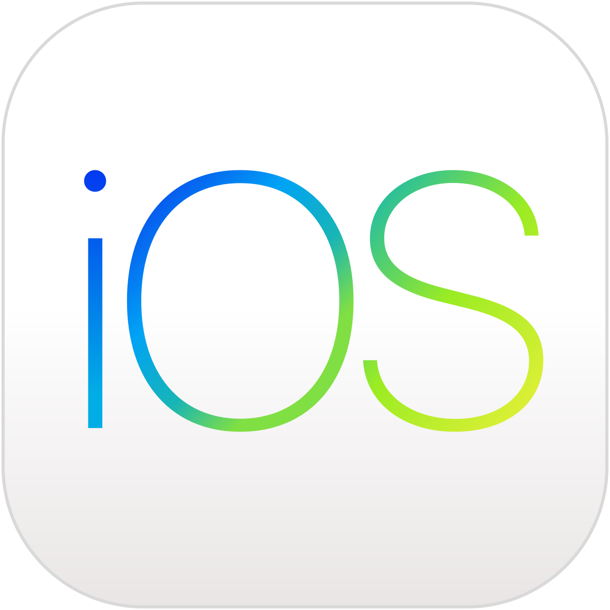
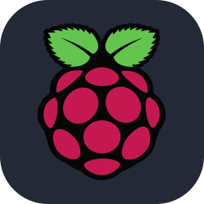
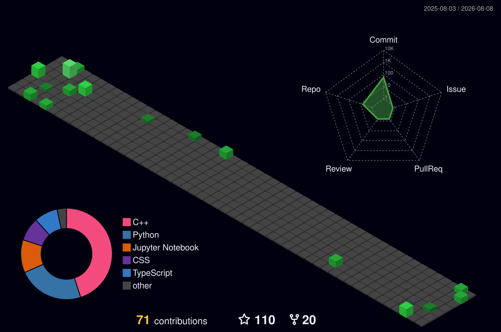

<!-- banner image to be updated -->

<!-- profile views -->

  

<!-- social links -->
<h3 align="center">🔗 Connect with me 🌏</h3>

    &nbsp;&nbsp;
    &nbsp;&nbsp;
    &nbsp;&nbsp;
    

 

<!-- ██████████████████████████████████████████████ -->
<!-- ░░░░░░░░░  TROPHIES — SECTION 2  ░░░░░░░░░░░░ -->
<!-- ██████████████████████████████████████████████ -->

## 🏆 Hall of Fame — GitHub Trophies
 

 

 

 
<!-- ██████████████████████████████████████████████ -->
<!-- ░░░░░░░░░░  ABOUT ME SECTION  ░░░░░░░░░░░░░░░ -->
<!-- ██████████████████████████████████████████████ -->

  
  
  

 

<!-- IDENTITY CARDS ROW -->

 
<!-- ACTIVE MISSIONS VISUAL TABLE -->

### ⚡ ACTIVE MISSIONS

| &nbsp;🔴 LIVE&nbsp; | &nbsp;⚙️ ROLE&nbsp; | &nbsp;🏢 ORGANIZATION&nbsp; | &nbsp;🏷️ BADGE&nbsp; |
| :---: | :--- | :--- | :---: |
| 🟢 | 💼 Student Advisory | Microsoft Student Society UEMK |  |
| 🟢 | 🎯 Finalist | BuildX IIT KGP |  |
| 🟢 | 🌐 Coordinator | SMART Makers Festival |  |
| 🟢 | ⚡ Member | IETE Student's Forum |  |
| 🟢 | 🚀 Infrastructure (Server) Lead | Ureckon |  |

  

### 🛠️ CURRENT BUILD STATUS

  

  

<h4 align="center">◈ Cyber Security | Hackathons | Event Tech | Technical Coordination ◈</h4>

 

<table width="100%" border="1" bordercolor="#30363d" cellspacing="0" cellpadding="20" style="border-collapse: collapse; background-color: #0d1117;">
  <tr>
    <td width="60%" valign="top">
      <h3 align="center">⚡ Engineering Philosophy</h3>
       
      <blockquote style="border-left: 4px solid #1f6feb; color: #00d2ff; background-color: #161b22; padding: 15px; border-radius: 5px;">
        <em>“Building secure, scalable systems that solve real-world problems through robust backend engineering, proactive cybersecurity, and continuous innovation.”</em>
          
        
- Snehasish Das

      </blockquote>
       
      <h4>🔷 Core Domains:</h4>
      <pre style="background-color: #161b22; padding: 15px; border-radius: 5px; color: #c9d1d9;">
🛡️  Cyber Security ──────────── Phishing, Malware, SOC, Pen Testing
🗄️  Database ────────────────── Mongo, Firebase, Supabase, MySQL
🤖  Android Development ─────── Android Studio
🧠  Artificial AI ───────────── Neural networks & ML
🏆  Hackathons ──────────────── Rapid prototyping
🔐  Authentication ──────────── OAuth, SMTP
⚙️  DevOps ──────────────────── Git, GitHub
🚀  Hosting ─────────────────── Vercel, Netlify
☁️  Cloud ───────────────────── AWS
💻  Languages Known ─────────── HTML, Python, C, Java
🐧  Platform ────────────────── Windows, Kali Linux, Ubuntu, Android
      </pre>
    </td>
    <td width="40%" align="center" valign="middle">
       <!-- Top GIF -->
       
        
       <!-- Bottom GIF -->
       
    </td>
  </tr>
</table>

 
</table>
 

 
<!-- github stats -->
<h3 align="center">📈 GitHub Stats 📊</h3>

  
  
    &nbsp;&nbsp;
   
  

 

 

 

<!-- ██████████████████████████████████████████████ -->
<!-- ░░░░░░░░░░  TECH STACK  ░░░░░░░░░░░░░░░░░░░░░ -->
<!-- ██████████████████████████████████████████████ -->

## ⚒️ Tech Arsenal

 

### ◈ Programming Languages

 

### ◈ Web Development

 

### ◈ AI & Machine Learning

 

### ◈ Databases

 

### ◈ Embedded & IoT

 

### ◈ Cloud & DevOps

 

 

<!-- ██████████████████████████████████████████████ -->
<!-- ░░░░░░  NEON DOMAIN BADGES  ░░░░░░░░░░░░░░░░░ -->
<!-- ██████████████████████████████████████████████ -->

## 🚀 Domains of Expertise

 

 

 

<!-- ██████████████████████████████████████████████ -->
<!-- ░░░░░░░░  LEADERSHIP TABLE  ░░░░░░░░░░░░░░░░░ -->
<!-- ██████████████████████████████████████████████ -->

## 🏆 Leadership & Command

 

| &nbsp;&nbsp;STATUS&nbsp;&nbsp; | &nbsp;&nbsp;ROLE&nbsp;&nbsp; | &nbsp;&nbsp;ORGANIZATION&nbsp;&nbsp; |
|:---:|:---:|:---:|
| 🔵 **ACTIVE** | 💼 Technical Lead | Microsoft Student Society UEMK |
| 🔵 **ACTIVE** | 🎯 Event Head | IGNITIA 2K26 |
| 🔵 **ACTIVE** | 🌐 Co Lead | IETE IEM |
| 🔵 **ACTIVE** | ⚡ IoT Lead | Vikrant EV |
| 🟢 **ACTIVE** | 🔬 Project Intern | IIT KGP Research Foundation |

 

 

<!-- ██████████████████████████████████████████████ -->
<!-- ░░░░░░░░░  FEATURED PROJECTS  ░░░░░░░░░░░░░░░ -->
<!-- ██████████████████████████████████████████████ -->

## 🚀 Featured Projects

 

| &nbsp;🔷 PROJECT&nbsp; | &nbsp;📋 DESCRIPTION&nbsp; | &nbsp;🏷️ DOMAIN&nbsp; |
|:---|:---|:---:|
| 🤖 **Robotics Systems** | Intelligent robotic solutions, autonomous navigation & control | `Robotics` |
| 🌐 **Smart IoT Applications** | Real-world IoT-based monitoring and automation systems | `IoT` |
| 👁️ **Computer Vision Suite** | AI-powered real-time object detection & visual intelligence | `CV · AI` |
| ⚡ **EV Technologies** | Embedded firmware and BMS for next-gen electric vehicles | `EV · Embedded` |
| 🔌 **Embedded Platforms** | Hardware-software integrated micro-controller systems | `Embedded` |
| 🏆 **Hackathon Innovations** | Rapid prototyping and award-winning product development | `Innovation` |

 

 

<!-- ██████████████████████████████████████████████ -->
<!-- ░░░░░░░░  GITHUB ANALYTICS  ░░░░░░░░░░░░░░░░░ -->
<!-- ██████████████████████████████████████████████ -->

## 📊 GitHub Analytics

 

&nbsp;&nbsp;

  

  

  

&nbsp;

 

 

<!-- ██████████████████████████████████████████████ -->
<!-- ░░░░░░░░  CONTRIBUTION GRAPH  ░░░░░░░░░░░░░░░ -->
<!-- ██████████████████████████████████████████████ -->

## 📈 Contribution Graph

 

 

 

<!-- Trophies moved to Section 2 — see top of file -->

 

 

<!-- ██████████████████████████████████████████████ -->
<!-- ░░░░░░░░░░  CONTRIBUTION GRID  ░░░░░░░░░░░░░░ -->
<!-- ██████████████████████████████████████████████ -->

## 🟩 Contribution Heatmap

 

 

 

<!-- ██████████████████████████████████████████████ -->
<!-- ░░░░░░░░░░  SNAKE ANIMATION  ░░░░░░░░░░░░░░░░ -->
<!-- ██████████████████████████████████████████████ -->

## 🐍 Contribution Snake

 

<picture>
  <source media="(prefers-color-scheme: dark)" srcset="https://raw.githubusercontent.com/Aranya01238/Aranya01238/output/github-contribution-grid-snake-dark.svg"/>
  <source media="(prefers-color-scheme: light)" srcset="https://raw.githubusercontent.com/Aranya01238/Aranya01238/output/github-contribution-grid-snake.svg"/>
  
</picture>

 

 

<!-- ██████████████████████████████████████████████ -->
<!-- ░░░░░░░░░  ENGINEERING MINDSET  ░░░░░░░░░░░░░ -->
<!-- ██████████████████████████████████████████████ -->

## ⚙️ Engineering Mindset

 

  

<!-- ██████████████████████████████████████████████ -->
<!-- ░░░░░░░░░░░  RANDOM DEV QUOTE  ░░░░░░░░░░░░░░ -->
<!-- ██████████████████████████████████████████████ -->

  

 

<!-- ██████████████████████████████████████████████ -->
<!-- ░░░░░░░░░░░░  FOOTER WAVE  ░░░░░░░░░░░░░░░░░░ -->
<!-- ██████████████████████████████████████████████ -->

### ⚡ Robotics &nbsp;×&nbsp; IoT &nbsp;×&nbsp; AI &nbsp;×&nbsp; Innovation ⚡

 

 

<!-- LeetCode stats -->
<h3 align="center">📊 Coding Stats 📈</h3>

<!-- Skills -->
<h1 align=center>
:books: Skills :desktop_computer:
</h1>
<h1>Platform:&nbsp;&nbsp; <!-- Platform -->
    &nbsp;&nbsp;
    &nbsp;&nbsp;
    &nbsp;&nbsp;
    &nbsp;&nbsp;
    &nbsp;&nbsp;
</h1>
<h1>Language & Script:&nbsp;&nbsp; <!-- Language & Script -->
    &nbsp;&nbsp;
    &nbsp;&nbsp;
    &nbsp;&nbsp;
    &nbsp;&nbsp;
    &nbsp;&nbsp;
    &nbsp;&nbsp;
    &nbsp;&nbsp;
</h1>
<h1>Frontend:&nbsp;&nbsp; <!-- Frontend -->
    &nbsp;&nbsp;
    &nbsp;&nbsp;
    &nbsp;&nbsp;
    &nbsp;&nbsp;
    &nbsp;&nbsp;
    &nbsp;&nbsp;
    &nbsp;&nbsp;
</h1>
<h1>Backend:&nbsp;&nbsp; <!-- Backend -->
    &nbsp;&nbsp;
    &nbsp;&nbsp;
</h1>
<h1>Database:&nbsp;&nbsp; <!-- Database -->
    &nbsp;&nbsp;
    &nbsp;&nbsp;
    &nbsp;&nbsp;
    &nbsp;&nbsp;
</h1>
<h1>Cloud:&nbsp;&nbsp; <!-- Cloud -->
    &nbsp;&nbsp;
    &nbsp;&nbsp;
    &nbsp;&nbsp;
</h1>
<h1>DevOps:&nbsp;&nbsp; <!-- DevOps -->
    &nbsp;&nbsp;
    &nbsp;&nbsp;
</h1>
<h1>IoT:&nbsp;&nbsp; <!-- IoT -->
    &nbsp;&nbsp;
    &nbsp;&nbsp;
</h1>
<!-- Profile 3D Contrib -->
<h1 align=center>
:heavy_plus_sign: Contributions :heavy_minus_sign:
</h1>

    

